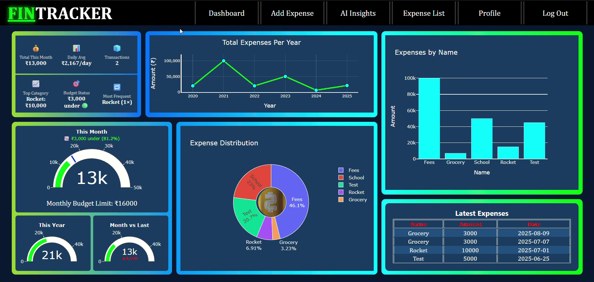

# 💸 FinTracker — AI-Powered Personal Finance Dashboard

FinTracker is a full-stack **Flask** web application that helps users **track expenses**, **set budgets**, and **gain financial insights** using **interactive dashboards** and **AI assistance** powered by [OpenRouter](https://openrouter.ai).

> ✅ Built for individuals who want a smarter, cleaner way to understand and manage their finances!

---

## 🚀 Features

* 🔐 **User Authentication** (Register & Login)
* 📊 **Dashboard with Dynamic Charts** (Bar, Pie, Line, Gauge using Plotly)
* 📝 **Add & View Expenses** — Sort by amount/date
* 💼 **User Profile Management** — Age, location, goals, monthly budget, etc.
* 💡 **AI-Powered Financial Summary** using OpenRouter (Markdown rendered)
* 📄 **Downloadable Reports** in `.txt` format
* ✅ **CI/CD** with **GitHub Actions** and **Pytest** test coverage
* 🔒 **Secure Password Hashing** with Bcrypt
* 💾 **SQLite3** backend (can be extended to PostgreSQL)

---

## 🖼️ Screenshots




---

## ⚙️ Setup Instructions

### 1. Clone the Repository

```bash
git clone https://github.com/yourusername/FinTracker.git
cd FinTracker
```

### 2. Create a Virtual Environment

```bash
python -m venv .venv
source .venv/bin/activate      # On Windows: .venv\Scripts\activate
```

### 3. Install Dependencies

```bash
pip install -r requirements.txt
```

### 4. All set! Now Run app.py

---

## 🔑 Setting Up OpenRouter API Key for AI Insights

FinTracker uses OpenRouter’s AI models to generate financial summaries and suggestions based on your profile + expenses.

### ✨ Steps to Get Your Own OpenRouter API Key:

1. Go to **[https://openrouter.ai](https://openrouter.ai)**
2. Create an account (free).
3. Navigate to **Account > API Keys**.
4. Generate a new API key (copy it).

### 🔐 Add API Key in `ai.py`:

Open `ai.py` and replace the placeholder API key with yours:

```python
client = OpenAI(
    base_url="https://openrouter.ai/api/v1",
    api_key="sk-or-<your-api-key-here>",  # 🗁 Replace this
)
```

✅ You're now ready to use AI features inside FinTracker!

---

## 🧪 Run Tests & Coverage (Optional)

To run all unit tests and see code coverage:

```bash
pytest --cov=. --cov-report=term-missing
```

> Or let **GitHub Actions** handle that for you on every push. The pipeline includes:
>
> * ✅ Pytest test run
> * 📈 Coverage report (HTML + terminal)
> * ✅ Artifact upload

---

## 🗁 Project Structure

```
FinTracker/
├── app.py                 # Main Flask app
├── ai.py                  # AI generation logic
├── templates/             # HTML Templates
├── static/                # CSS/JS/Assets
├── database.db            # SQLite DB
├── requirements.txt       # Dependencies
├── .github/workflows/     # GitHub Actions CI/CD
└── README.md              # This file!
```

---
